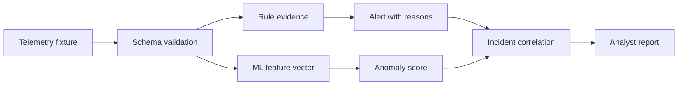

# Detection pipeline

```mermaid
flowchart LR
    A[Telemetry fixture] --> B[Schema validation]
    B --> C[Rule evidence]
    B --> D[ML feature vector]
    C --> E[Alert with reasons]
    D --> F[Anomaly score]
    E --> G[Incident correlation]
    F --> G
    G --> H[Analyst report]
```

The separation between rule evidence and anomaly score is intentional: analysts can challenge a rule or tune a model without losing the other signal.
